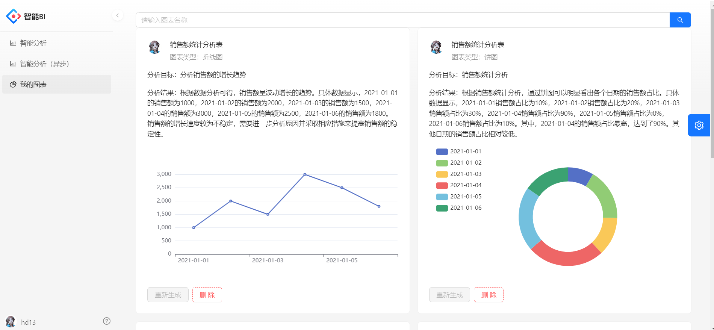

### HD智能BI系统
* 前端代码地址：https://github.com/HrD13/HD-BI-frontend
* 基于 Spring Boot+ AI 的智能数据分析平台。用户只需要导入原始数据集、并输入分析诉求，就能自动生成可视化图表及分析结论，实现降低数据分析的人工成本、提高数据分析效率。 
### 在线地址：http://47.107.78.104
### 本地运行：
* 执行sql文件夹的create_table.sql建表语句。
* 修改application.yml相关配置信息。
* Knife4j + Swagger接口文档示例地址：http://localhost:8001/api/doc.html#/
### 运行环境:
| 环境 | 版本 |
| ------- | ------- |
| JDK | 1.8 |
| MySQL | 8.0.34 |
| Redis | 5.0.5 |
| SpringBoot | 2.7.2 |
### 项目特点：
* 后端自定义 Prompt 预设模板并封装用户输入的数据和分析诉求，通过对接 AIGC 接口生成可视化图表 json 配置和分析结论，返回给前端渲染。
* 由于 AIGC 的输入 Token 限制，使用 Easy Excel 解析用户上传的 XLSX 表格数据文件并压缩为 CSV，实测提高了 20% 的单次输入数据量、并节约了成本。
* 为保证系统的安全性，对用户上传的原始数据文件进行了后缀名、大小、内容等多重校验。
* 为防止某用户恶意占用系统资源，基于 Redisson 的 RateLimiter 实现分布式限流，控制单用户访问的频率。 
* 由于 AIGC 的响应时间较长，使用 RabbitMQ（分布式消息队列）来接受并持久化任务消息，提交任务后即可响应前端，通过 Direct 交换机转发给解耦的 AI 生成模块消费并处理任务，提高了系统的可靠性。 
* 使用 Knife4j + Swagger 自动生成后端接口文档，并通过编写 ApiOperation 等注解补充接口注释，避免了人工编写维护文档的麻烦。
### 项目截图

